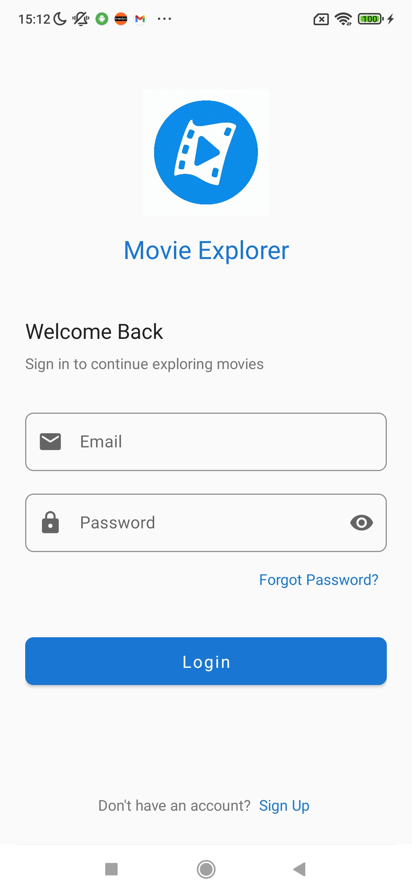
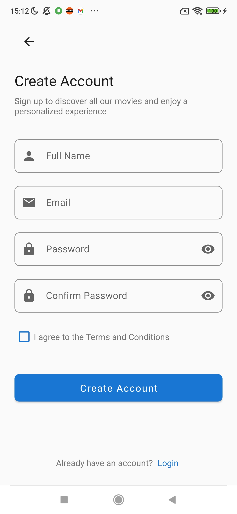
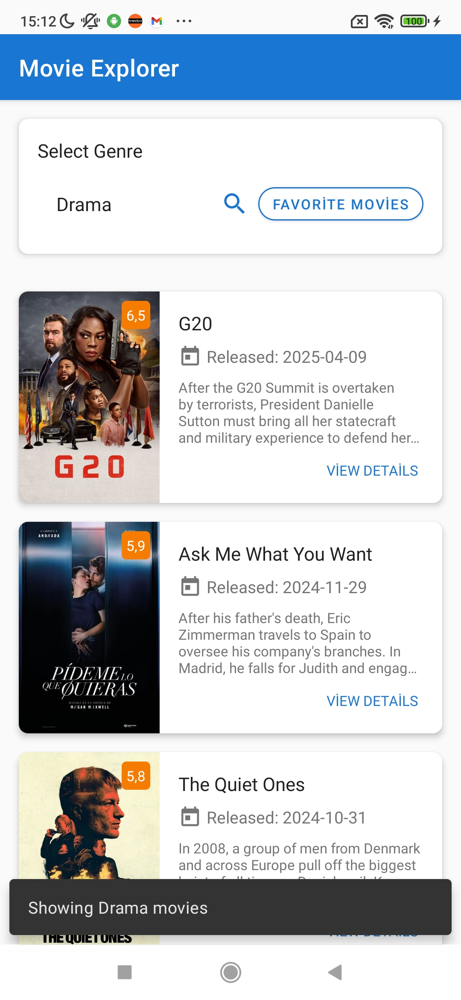
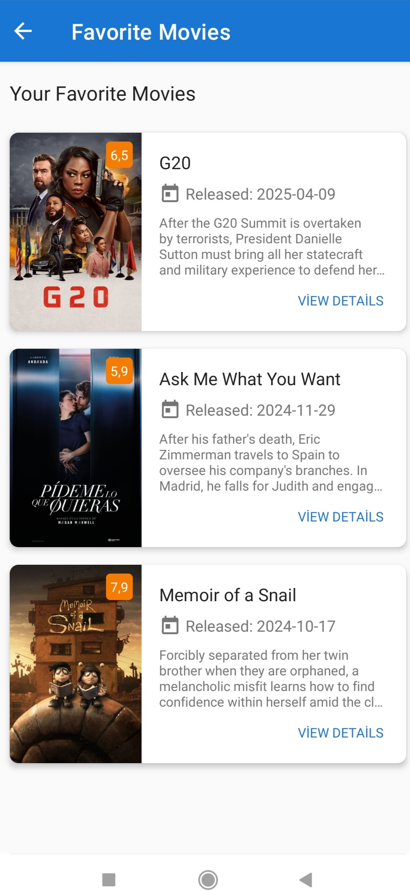
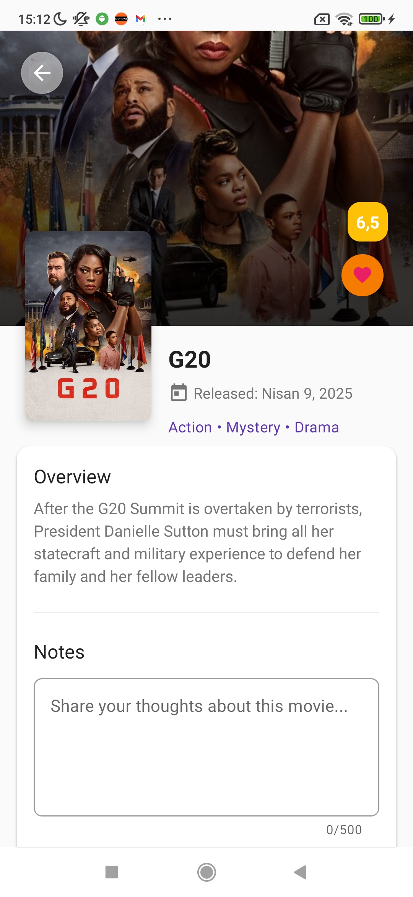
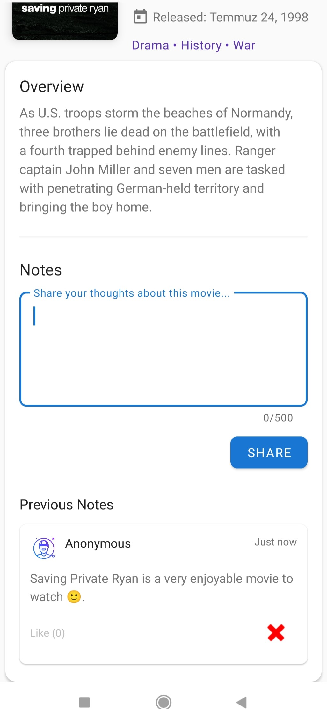

Movie Explorer
Movie Explorer, film tutkunları için Kotlin programlama dili kullanılarak geliştirilmiş kapsamlı bir Android uygulamasıdır. Modern Android geliştirme araçları ve mimarisi kullanılarak oluşturulmuştur.
Özellikler

Kullanıcı Hesapları: Firebase Authentication ile e-posta ve şifre kullanarak güvenli giriş yapma
Film Keşfi: Geniş film kütüphanesine türlerine göre erişim
Arama Fonksiyonu: Film adına göre arama yapabilme
Sosyal Etkileşim: Filmler hakkında yorum yapma ve başkalarının yorumlarını beğenme
Favori Listesi: Beğendiğiniz filmleri favori listenize ekleyerek daha sonra izlemek üzere kaydetme
Önbellek Sistemi: Room Database ile API çağrılarını optimize etme ve verileri yerel olarak saklama
Modern UI: Cursor ve diğer modern tasarım öğeleri kullanılarak geliştirilmiş kullanıcı arayüzü

Teknoloji Yığını

Dil: Kotlin
Mimari: MVVM (Model-View-ViewModel)
Arayüz Bağlama: DataBinding
Asenkron İşlemler: Kotlin Coroutines
Veri Önbelleği: Room Database (API çağrılarını azaltmak için)
Ağ İstekleri: Retrofit ve RxJava
Kullanıcı Yönetimi: Firebase Authentication
Bulut Veritabanı: Firebase Firestore (yorumlar ve kullanıcı verileri için)
UI Bileşenleri: Cursor ve modern Material Design komponentleri

Ekran Görüntüleri

markdown
markdown
markdown
markdown
markdown
markdown

Uygulama Mimarisi
Uygulama Kotlin'in modern özelliklerinden faydalanarak hybrid bir veri mimarisi kullanmaktadır:

Film Verileri: Film bilgileri API'den çekilir ve Room veritabanında önbelleğe alınır. Bu sayede API çağrıları optimize edilir.
Kullanıcı Verileri: Kullanıcı hesapları Firebase Authentication ile yönetilir.
Yorumlar ve Etkileşimler: Kullanıcı yorumları ve beğeniler Firebase Firestore'da saklanır, böylece gerçek zamanlı güncellemeler sağlanır.

Bu yapı sayesinde uygulama hem performanslı hem de etkileşimli bir kullanıcı deneyimi sunar.
Kullanıcı Arayüzü
Uygulama tasarımında Cursor kullanılarak modern ve etkileşimli bir kullanıcı deneyimi hedeflenmiştir. Cursor bileşenleri özellikle aşağıdaki alanlarda kullanılmıştır:

Navigasyon elemanları
Film listeleme ekranları
Yorum alanları
Kullanıcı etkileşim noktaları

Material Design prensipleri ile birleştirilen Cursor bileşenleri sayesinde, kullanıcılar için sezgisel ve estetik bir arayüz oluşturulmuştur.
Veri Akışı

Kullanıcı uygulamaya Firebase Authentication aracılığıyla giriş yapar
Film verileri ilk olarak Room veritabanından kontrol edilir
Gerektiğinde film API'sine istek gönderilir ve veriler güncellenir
Kullanıcı yorumları ve beğenileri Firestore'dan gerçek zamanlı olarak çekilir ve güncellenir
