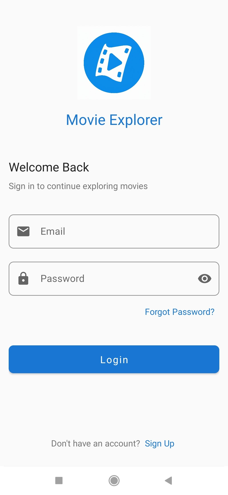

# 🎬 Movie Explorer

**Movie Explorer**, film tutkunları için Kotlin programlama dili kullanılarak geliştirilmiş kapsamlı bir Android uygulamasıdır. Modern Android geliştirme araçları ve mimarisi kullanılarak oluşturulmuştur.

---

## 🚀 Özellikler

- 🔐 **Kullanıcı Hesapları:** Firebase Authentication ile e-posta ve şifre kullanarak güvenli giriş yapma  
- 🎞️ **Film Keşfi:** Geniş film kütüphanesine türlerine göre erişim  
- 🔎 **Arama Fonksiyonu:** Film adına göre arama yapabilme  
- 💬 **Sosyal Etkileşim:** Filmler hakkında yorum yapma ve başkalarının yorumlarını beğenme  
- ❤️ **Favori Listesi:** Beğendiğiniz filmleri favori listenize ekleyerek daha sonra izlemek üzere kaydetme  
- 🧠 **Önbellek Sistemi:** Room Database ile API çağrılarını optimize etme ve verileri yerel olarak saklama  
- ✨ **Modern UI:** Cursor ve diğer modern tasarım öğeleri kullanılarak geliştirilmiş kullanıcı arayüzü  

---
Ekran Görüntüleri

---
## 🛠️ Teknoloji Yığını

- **Dil:** Kotlin  
- **Mimari:** MVVM (Model-View-ViewModel)  
- **Arayüz Bağlama:** DataBinding  
- **Asenkron İşlemler:** Kotlin Coroutines  
- **Veri Önbelleği:** Room Database (API çağrılarını azaltmak için)  
- **Ağ İstekleri:** Retrofit ve RxJava  
- **Kullanıcı Yönetimi:** Firebase Authentication  
- **Bulut Veritabanı:** Firebase Firestore (yorumlar ve kullanıcı verileri için)  
- **UI Bileşenleri:** Cursor ve modern Material Design komponentleri  
---
## Uygulama Mimarisi
- Uygulama Kotlin'in modern özelliklerinden faydalanarak hybrid bir veri mimarisi kullanmaktadır.

- Film Verileri: Film bilgileri API'den çekilir ve Room veritabanında önbelleğe alınır. Bu sayede API çağrıları optimize edilir.
- Kullanıcı Verileri: Kullanıcı hesapları Firebase Authentication ile yönetilir.
- Yorumlar ve Etkileşimler: Kullanıcı yorumları ve beğeniler Firebase Firestore'da saklanır, böylece gerçek zamanlı güncellemeler sağlanır.

- Bu yapı sayesinde uygulama hem performanslı hem de etkileşimli bir kullanıcı deneyimi sunar.
- Kullanıcı Arayüzü
- Uygulama tasarımında Cursor kullanılarak modern ve etkileşimli bir kullanıcı deneyimi hedeflenmiştir. Cursor bileşenleri özellikle aşağıdaki alanlarda kullanılmıştır:
- Navigasyon elemanları
- Film listeleme ekranları
- Yorum alanları
- Kullanıcı etkileşim noktaları
---
